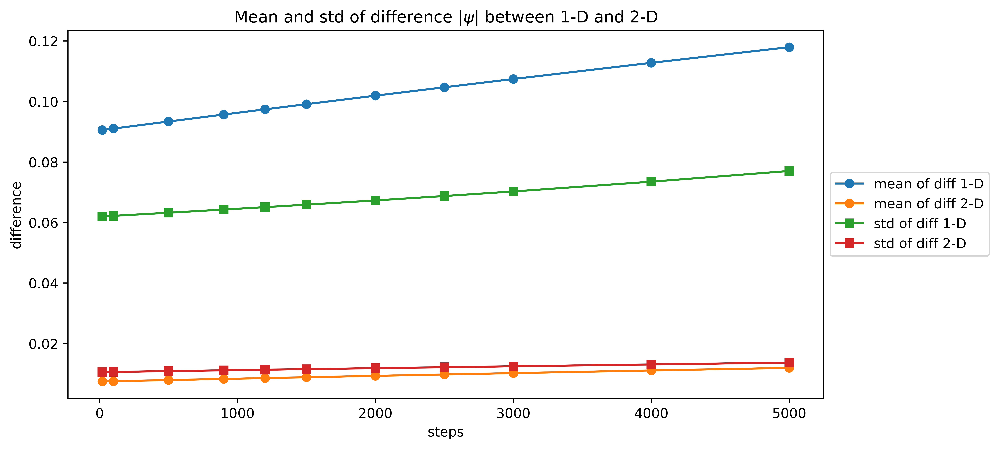

# The Gross-Pitaevskii equation using spectral method in 1D & 2D

The Gross-Pitaevskii equation (GPE), a nonlinear Schr ̈odinger equation (NLSE)
for the macroscopic wave functions, governs the properties of a BEC at temperatures
$T$ far below the critical condensation temperature $T_c$. The GPE includes a term for
the trap potential as well as the mean field interaction between atoms in the gas which
manifests as a nonlinear term. Attractive interactions as well as repulsive interactions
are accounted for in the GPE through the use of a focussing constant which may be
positive (focussing) or negative (defocussing). 

## The Gross-Pitaevskii equation
**Time dependent Equation is:**
$
i\hbar\frac{\partial\psi(\bold{x}, t)}{\partial t} = -\frac{\hbar}{2m}\nabla^2\psi(\bold{x}) + \bold{V}(\bold{x}) \psi(\bold{x})  + NU_0 |\psi(\bold{x})|^2\psi(\bold{x})
$

where:
$
U_0 = \frac{4\pi\hbar^2a}{m} (a \text{ is scattering length)}
$
### Methodology: ###
I've solved this equation numerically by using  time-splitting trigonometric spectral approximations of the problem, with periodic boundary conditions. 
## Simulations in 1D & 2D
I've Used time spitting sprectral scheme Lie splitting followed by strang splitting spectral method.
The time-splitting spectral schemes LS and SS are unconditionally
stable. In fact,under any mesh size $\Delta \bold{x}$ and time step $\Delta t$.

### Animation in 1-D
The animation of the wave function is shown below.

Simulation of $\psi(x, t)$ in 1-D. At $\Delta x = \frac{2\pi}{500}$, $\Delta t = 0.01$ and $ -\pi \le x \le \pi$.

Potential is $V(x) = \frac{x^2}{2}$ and $\psi(x,0) = \frac{1}{(\pi)^\frac{1}{4}}\exp(\frac{-x^2}{2})$

### Animation in 2-D

Simulation of $\psi(x,y, t)$ in 2-D. At $\Delta x = \Delta y =\frac{2\pi}{256}$, $\Delta t = 0.01$ and $ -\pi \le x \le \pi$, $ -\pi \le y \le \pi$.

Potential is $V(x, y) = \frac{(x^2 + y^2 )}{2}$ and $\psi(x, y,0) = \frac{1}{\sqrt{\pi}}\exp(\frac{-(x^2 + y^2)}{2})$.

## Comparision B/W Leapfrog method and TSSP ##

## Refrences: ##

Galati, Luigi, "Numerical Solutions to the Gross-Pitaevskii Equation for Bose-Einstein 
Condensates" (2013). Electronic Theses and Dissertations. 844. 

